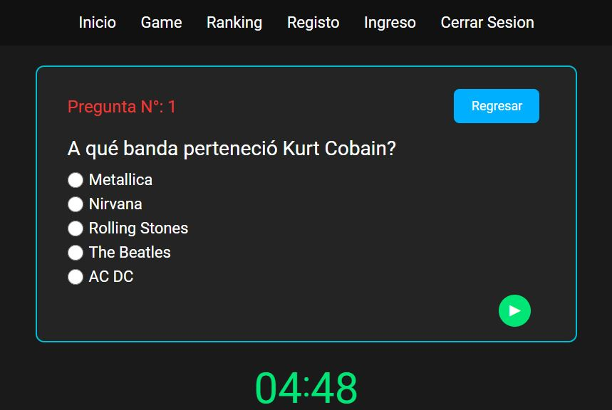

# Vue 3 + TypeScript + Vite

This template should help get you started developing with Vue 3 and TypeScript in Vite. The template uses Vue 3 `<script setup>` SFCs, check out the [script setup docs](https://v3.vuejs.org/api/sfc-script-setup.html#sfc-script-setup) to learn more.

### Screenshot



## _Ejercicio 2: Trivia_

* 1- Construye una aplicación que cuando ingreses deberá pedir ingresar algunos datos
* 2- Luego de eso podré elegir una categoría de preguntas y a continuación, mostrará de manera aleatoria preguntas que se encuentran en un banco de preguntas con 5 simples respuestas, pero solo una es la correcta
* 3- Debe pedirme responder 20 preguntas, y cuando termine la ultima, debe entregarme un mensaje de felicitaciones y agregarme al ranking de usuarios que han terminado el juego de trivia
* 4- Finalmente debe mostrarme el tiempo que me tomó terminar esta trivia

## What I learned

```html
<p>
  <input type="radio" id="one" value="One" v-model="picked" />
  <label for="one">{{ props.alt_two }}</label>
</p>
```

```js
import { ref } from "vue";

let picked = ref("");
const props = defineProps<{
  answer: string;
  alt_one: string;
  alt_two: string;
  alt_thee: string;
  alt_four: string;
}>();
```
## Timer in vue3 setup

```html
    <div v-if="loaded" class="Timer_container">
        <div class="minutos">
            <p :class="[{ lowTime: lowTime }, { midTime: midTime }, { enoughTime: enoughTime }]" class="displays">{{
                    Displayminutes
            }}</p>
        </div>
        <span :class="[{ lowTime: lowTime }, { midTime: midTime }, { enoughTime: enoughTime }]">:</span>
        <div class="segundos">
            <p :class="[{ lowTime: lowTime }, { midTime: midTime }, { enoughTime: enoughTime }]" class="displays">{{
                    Displayseconds
            }}</p>
        </div>
    </div>
```
```js
import { ref, onMounted } from 'vue';

let Displayminutes = ref()
let Displayseconds = ref();
let loaded = ref(false)
let lowTime = ref(false)
let midTime = ref(false)
let enoughTime = ref(true)

const seconds = 1000;
const minutes = seconds * 60;
const setTime = 300000;
const startTime = Date.now();
const futureTime = startTime + setTime;

const Coutdown = () => {
    const timer = setInterval(() => {
        const currentTime = Date.now();
        const gap = futureTime - currentTime;

        if (gap < 0) {
            clearInterval(timer)
            return;
        }
        if (gap < 150000) {
            enoughTime.value = false
            midTime.value = true
        }
        if (gap < 60000) {
            lowTime.value = true
        }
        const mins = Math.floor(gap / minutes)
        const secs = Math.floor((gap % minutes) / seconds)

        Displayminutes.value = mins < 10 ? "0" + mins : mins
        Displayseconds.value = secs < 10 ? "0" + secs : secs
        loaded.value = true
    }, 1000)
}
onMounted(() => {
    Coutdown()
})

```
```scss
.Timer_container {
    color: white;
    display: flex;
    justify-content: center;

    .enoughTime {
        color: #00e676;
    }

    .midTime {
        color: yellow;
    }

    .lowTime {
        color: red;
    }


    p {
        font-size: 1.8rem;
    }

    span {
        font-size: 5rem;
    }

    .displays {
        font-size: 6rem;
        text-align: center;
    }
}
```

## Author

- Website - [Nicolas_Bouffanais](https://nicolas-bouffanais.vercel.app/src/index.html)
- Twitter - [@N_Bouffanais](https://twitter.com/N_Bouffanais)
